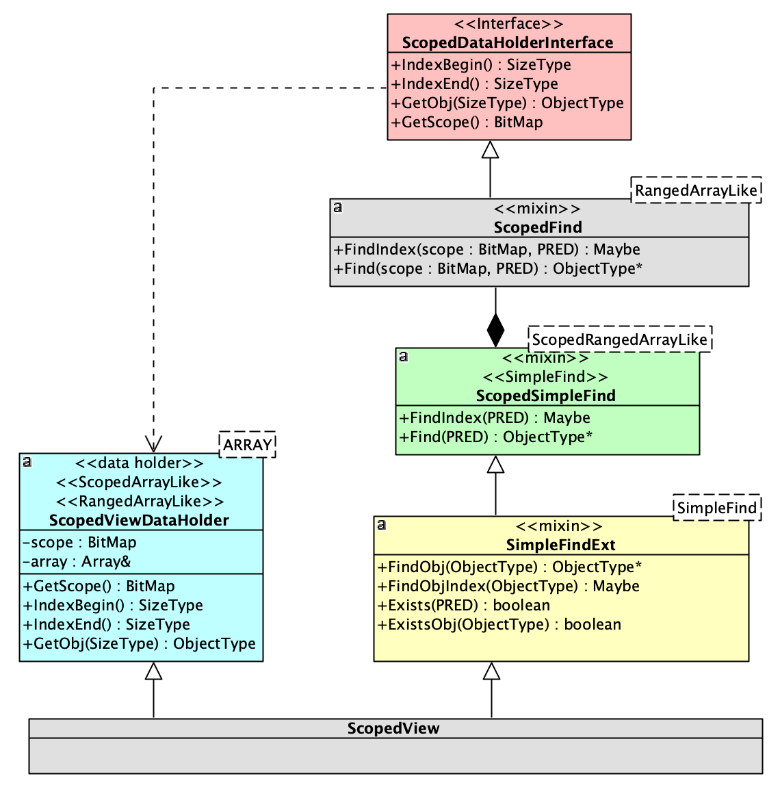

Mixin
================

正如我们之前所见，`ObjectArray` 库里包含多种 `array` 以及 `view` 。

而相关的算法，一些在这些 `array/view` 中均可复用，而另外一些只能在少数 `array/view` 中可复用。
有少数甚至只能在个别 `array/view` 中单独使用。如何解决这种变化多端的复用问题？

**组合式设计** 是解决多种变化方向问题的利器。

而对于 `ObjectArray` 库， 这种组合式设计的手段是 `mixin` 。

核心算法和扩展算法
----------------------------

对于很多算法而言，只要你实现了最核心的一个或几个，其它的都可以基于它进行实现。比如：

.. code-block:: c++

   template<typename PRED>
   auto FindIndex(PRED &&pred) const -> std::optional<SizeType>;

   template<typename PRED>
   auto Find(PRED &&pred) const -> ObjectType const&;

只要你实现基于谓词的 ``FindIndex`` 和 ``Find`` （事实上，如果不考虑 ``Find`` 与 ``FindIndex`` 在算法上可以给出不同实现的因素，二者只需要实现其中一个，
另外一个即可以据它实现），你就可以扩展出下列算法：

.. code-block:: c++

   auto FindIndex(ObjectType const& obj) const -> std::optional<SizeType> {
      return FindIndex([&](auto&& elem) { return elem = obj; });
   }

   auto Find(ObjectType const& obj) const -> auto* {
       return Find([&](auto&& elem) { return elem == obj;});
   }

   template<typename PRED, __pReD_cHeCkEr>
   auto Exists(PRED &&pred) const -> bool {
       return Find(std::forward<PRED>(pred)) != nullptr;
   }

concept
-----------------------

我们随后以 ``SimpleFind`` 和 ``SimpleFindExt`` 这一族算法的 `mixin` 设计为例，来讨论整个 `mixin` 体系
的设计。

首先，``SimpleFind`` 和 ``SimpleFindExt`` 的之间的关系如下：

如果你仔细看这张图，会发现 ``SimpleFindExt`` 本身是一个 `mixin` ，而它所依赖的是一个抽象的
被称作 `concept` 的元素。

`concept` 不是 `class` 或 `template` ，它是一个被 `C++ 20` 标准化了的概念。但事实上，即便
这个概念没有被标准化，没有任何语法元素支持，它也是早就存在的设计概念。

简单说， `concept` 就相当于我们熟悉的用于 **运行时多态** 的 `interface` ，或 **纯虚类** 。
但它不是用于 **运行时多态** ，而是用于 **编译时多态** 。因而它是一个静态接口，没有任何运行时代价。

由于编译时多态是基于特征的（而不是函数接口，虽然特征也可以是函数接口），因而 `concept` 所描述的是
一个模版对于它要依赖的类型的特征要求。所有可以用来实例化这个模版的类型都必须满足这些特征。

事实上，在 `C++ 20` 之前，这些要求也是存在的（否则就不可能编译通过），但由于没有语法元素来明确
描述这些要求，因而一则对于代码阅读者无法通过一份接口规范来清晰地知道这些约束是什么；二则，当编译
出错时，晦涩的出错信息让程序员很难快速定位出出错的原因。

无论如何，即便你仍在使用 `C++ 17` ，甚至更早的编译器，你无法直接通过语法元素直接表达，但这并不
妨碍从设计概念上， `concept` 依然是存在的。

现在回到我们的问题。为何 ``SimpleFindExt`` 依赖的是一个抽象的 `concept` ，而不是一个具体的类？

像所有的多态一样，因为变化。对于 ``SimpleFind`` 这样一个 `concept` ，我们的库里至少有两种不同的
需求，因而有两种不同的实现：

.. image:: images/multi-simple-find.png

分类
-------------

在进一步讨论之前，我们先将我们的 `Array` 和 `View` 进行一下分类：

  1. `NonScopedArrayLike`

     - `ScatteredArray`
     - `ScopedArrayView`

  2. `ScopedArrayLike`

     - `ObjectArray`
     - `ArrayView` / `ConstArrayView`
     - `Slice`

之所以会有这两种不同的 ``SimpleFind`` ，是因为 `ScopedArrayLike` 而言，
它们自身都有一个 ``Scope`` ，而对于 `NonScopedArrayLike` ，
则没有 ``Scope`` ，而这两种的 ``Find`` 实现是不一样的。

但是一旦各自给出了最核心的 ``Find`` ，那么所有基于它们的扩展算法 （ ``SimpleFindExt`` ）则是完全一样的。

而这其中最有趣的一点是： ``ScopedSimpleFind`` 所依赖的 ``ScopedFind`` ，本身属于 `NonScopedArrayLike` 一族的
正常接口，因为我们可以写出如下代码：

.. code-block:: c++

   ObjectArray<int, 10> array;

   array.Find(0xa5,  { return item == 5 }); // 1st argument is a scope.

   array.Scope(0xa5).Find( { return item == 5 });

但是却不允许对 `ScopedArrayLike` 一族提供上述的接口（ 因为它们已经属于 `Scoped` )。

因而，对于 `NonScopedArrayLike` 一族，存在 ``ScopedFind`` 以及它的扩展 ``ScopedFindExt`` 等一族接口。
但 `ScopedArrayLike` 却没有这样的接口。

但有趣的地方也正在于此，`ScopedArrayLike` 一族的 ``SimpleFind`` 实现却可以通过复用 ``ScopedFind`` `mixin` 来实现。

它们的关系如下图所示：

.. image:: images/simple-scoped-find.png

NonScopedSimpleFind
+++++++++++++++++++++++++++++

而具体到 ``NonScopedSimpleFind`` 的实现，它也需要依赖一个 `concept` :  ``RangedArrayLike`` 。
因为 ``Find`` 与 ``FindIndex`` 的算法实现，仅仅需要依赖两类元素：

   1. 搜索的 `Range` : `[begin, end)` ，对应如下两个方法：

      - ``IndexBegin() -> SizeType``
      - ``IndexEnd() -> SizeType``

   2. 每个索引位置的对象：

      - ``GetObj(i) -> ObjectType const&``

而拥有这三个接口的概念为 ``RangedArrayLike`` 。而对于此 `concept` 的实现，可以分为两类：

   1. ``ObjectArray``, ``ArrayView`` ，它们的 `range` 是 `[0, num)` ;
   2. ``Slice`` 的 `range` 是切片创建时指定的 `range` ；

由于现在我们讨论的是 `NonScopedSimpleFind` ，因而 `ScopedArrayLike` 一族的因素暂时不予讨论。

因而，它们的关系如下：

.. image:: images/ranged-array-like.png

图中，`RangedViewArrayHolder` 对应的就是 `slice` 的数据类。而 ``RangedArray`` 这个 `mixin` ，
则由 ``ObjectArray`` 和 ``ArrayView`` 组合。

如果只考虑 `NonScopedArrayLike` ，那么 ``RangedArray`` 到具体的数据类的关系如下：

.. image:: images/array-like.png

在这样的关系下， ``RangeArray`` 三个方法的实现如下：

.. code-block:: c++

   template <_concept::ArrayLike T>
   struct RangedArray {
      auto IndexBegin() const -> SizeType {
         return 0;
      }

      auto IndexEnd() const -> SizeType {
         return (ArrayLike const*)(this)->GetRange();
      }

      auto GetObj(SizeType n) const -> ObjectType const& {
         return ArrayLike::ElemToObject((ArrayLike const*)(this)->Elems()[n]);
      }
   };

为何 ``IndexEnd()`` 调用的是 ``GetRange`` ，而不是直接返回数组元素的个数： ``num`` ？

这是因为，``ArrayLike`` 这个 `concept` 不仅仅是 `NonScopedArrayLike` 才有的概念，
`ScopedArrayLike` （ ``ScatteredArray`` ）同样有这个概念。 ``ScatteredArray`` 的
``GetRange`` 返回的不是 ``num`` (它没有这个属性），而是 ``MAX_SIZE`` （代表它遍历的范围
是整个数组空间）。

ScopedSimpleFind
+++++++++++++++++++++++++++++

`ScopedSimpleFind` 相对于 `NonScopedSimpleFind` ，复杂度稍微上升了一点，因为它需要一个额外的
接口: ``GetScope`` 。而 ``Find`` 操作，只能在 `scope` 指定的范围内进行。

而 `ScopedView` 与 `ScatteredArray` 都属于此类。它们的关系如下：

.. image:: images/scoped-find.png

其中 `ScopedView` 聚合了一个提供了 `RangedArrayLike` 概念的对象，无论那个对象是
一个 `ObjectArray` , `ArrayView` 还是一个 `Slice` ，`ScopedView` 都并不关心，
只要它们都提供了 `RangeArrayLike` 概念所要求的接口。

而 `ScopeView` 只是通过转调它们的 `RangedArrayLike` 接口来让自己也成为一个
满足 `RangedArrayLike` 概念的对象。

而 `ScatteredView` 则通过 `RangedArray mixin` 来让自己满足 `RangedArrayLike` 概念。

而两者都通过自己所持有的 ``BitMap`` 类型的数据来满足 `ScopedArrayAlike` 概念。

如果一个对象既满足 `RangedArrayLike` 概念， 又满足 `ScopedArrayAlike` 概念，从语义上就满足
了 `RangedArrayLike + ScopedArrayAlike` 概念。而 `C++ 20` 则通过 ``RangedArrayLike && ScopedArrayAlike`` 来
表达这种概念上的组合关系。我们将这个组合后的概念，定义为一个新概念 `ScopedRangedArrayLike` ：

mixin
--------------

到了现在，我们需要来谈一下什么叫 `mixin` 了。

简而言之， `mixin` 是个可以与对象进行组合的 `class/template class` 。它本身不应该有任何数据，
因而可以通过 ``std::is_empty_v<MIXIN>``  谓词断言。

由于它本身没有任何数据，因而拼接在对象身上不会引起对象二进制结构 （内存布局）的任何变化。所以，它们
的 ``this`` 指针的位置与整个对象的 ``this`` 指针位置一致。

这样的 `mixin` 与其它语言比如 `scala` 所提供的 `trait` 概念上很相似。（ `scala trait` 允许
提供算法实现，并且其 `trait` 组合顺序与声明顺序一致）。

之所以使用 `mixin` 这样的概念，是为了让一个 `mixin` 所提供的实现，能够在不同的对象间方便的复用。

组合
---------------

现在到了我们进行组合的时候了。我们先来看看 ``ObjectArray`` :

.. image:: images/object-array-simple-find.png

从图中优美的线条我们看出，这是一个层层依赖的结构。

因而，对于 `mixin` 我们可以使用单线继承的方式来进行组合：

而其中每个 `mixin` 都是类似于下面的定义：

.. code-block:: c++

   template <Concept T>
   struct Mixin : T  {
      using Self = T;
      using Self::method; // import T::method
      using typename Self::Type // import T::Type
      // more imports

      // its own algorithm.
      auto DoSth() -> Bar {
         // ...
      }

      // more algorithms.
      // ...
   };

我们总是将被依赖的 `mixin` 放在父类的位置；如果相互双方没有任何依赖关系
（比如 ``SimpleFindExt`` 与 ``ScopedFindExt`` )，那么它们在继承线上先后顺序也无所谓。

这样的组合方式，有一个明显的问题：子类对于父类同名函数的遮掩问题（比如 `SimpleFindExt` 与 `ScopedFindExt` 里都有 ``Find`` ，
虽然它们的参数列表并不相同）。

对于这样的问题，没有自动解决的办法，只能要么避免各个 `mixin` 间出现同名函数（需要全局知识）；要么放在下面的 `mixin` 如果知道放在上面
的某个 `mixin` 存在与自己同名的函数，就负责明确地通过 ``using`` 来 `import` （这也需要全局知识）。

这当然是一个令人讨厌的地方，但对于所有 `mixin` 都在我们的控制之中（我们只是想通过分解为 `mixin` 达到复用目的），
这一点并不会带来明显的设计和维护负担。

CRTP
---------------

使用这种方式进行组合的另外一个缺点是，这几乎总是导致数据类 ( `DataHolder` ) 被放在最顶层。

这本身没有任何问题，但却会导致 `debug` 时，如果需要查看数据，需要点开太多的层次（由于类层次很深）。每次层层点击打开的过程都让人精疲力尽，不厌其烦。

解决这种问题的办法是，我们将 `DataHolder` 从继承线的顶部移动到底部，变为下面的结构：

而这样的结构变化，让那些 `mixin` 如何访问 `DataHolder` 上的数据和方法编程了一个问题。

但 `C++` 范型有一个非常有趣的模式，叫做 `CRTP` （ `Curiously Recurring Template Pattern` ）。
即，一个作为父类，或者兄弟类的模版类，可以访问其子类的成员。

.. code-block:: c++

   template <typename T>
   struct Base {
      auto interface() -> void {
         // ...
         static_cast<T*>(this)->implementation();
         // ...
      }

      static auto static_func() -> void {
         // ...
         T::static_sub_func();
         // ...
      }
   };

   struct Derived : Base<Derived> {
      void implementation();
      static void static_sub_func();
   };

我们之前已经讲过，由于我们的 `mixin` 都是没有任何数据的模版类，它们的存在与否并不会影响整个对象的
内存布局。因而我们安全的将某个 `mixin` 的 ``this`` 指针强行转化为 `DataHolder` 的指针。

另外，由于我们只是把 `DataHolder` 从继承线上移出，`mixin` 们仍然保持了继承结构。我们我们只需要
让 `DataHolder` 提供一个的替身 ：它提供了 `DataHolder` 希望对外暴露的接口，但
本身又是一个类似于 `mixin` 的空类。我们将其成为 `DataHolder interface` 。如下图所示：

而 `DataHolder interface` 对 `DataHolder` 的访问，则是通过 `CRTP` 来完成：

.. code-block:: c++

   template <typename DATA_HOLDER>
   class ContinuousArrayDataHolderInterface {
       auto This() const -> DATA_HOLDER const* {
           return reinterpret_cast<DATA_HOLDER const*>(this);
       }
       auto This() -> DATA_HOLDER* {
           return reinterpret_cast<DATA_HOLDER*>(this);
       }
   public:
       using SizeType = typename DATA_HOLDER::SizeType;
       using ElemType = typename DATA_HOLDER::ElemType;

       auto Num() -> SizeType& {
          return This()->num;
       }
       auto Elems() -> ElemType* {
          return This()->elems;
       }
       static auto ElemToObject(ElemType& elem) -> ObjectType& {
          return DATA_HOLDER::ElemToObject(elem);
       }
   };

在组合了 `ObjectArray` 之后，我们发现 `ArrayView` 的组合方式与 `ObjectArray` 是一致的，除了 `DataHolder` 不同之外：

而 `Slice` 需要的 `mixin` 要比 `ObjectArray` 少一些，因而它比较简单：

`ScopedView` 是一个不同的物种，如下图：

正如我们之前所讨论的，它本身不再提供 `ScopedFind` 接口，但却会利用 `ScopedFind` 来
实现 `SimpleFind` ，因而即便从具体实现上这依然是通过继承来实现，但在图中我们用组合关系来表达。

而 `ScatteredArray` 则与 `ScopedView` 属于同一类：

实际上，每一种对象最终拼合的 `mixin` 要比这里举例的要多得多。但它们依据的方法是一致的。这里就不再赘述。

最后给出与 `Find` 有关的全景视图，仔细查看它们的方法，会有助于理解为何会存在这些 `mixin` 以及为何它们
之间是那样的关系。

可见性
--------------------

我们的每一种 `array/view` 都组合了多个 `mixin` ，但并不是所有的 `mixin` 所提供的接口都应该是用户可见的。

所以我们就面临一个问题：如何让用户仅仅可以访问我们允许他访问的接口？

一种最直接的办法是，把所有的 `mixin` 组合都首先设置为 ``protected`` 或 ``private`` ，然后在最下面的类通过 ``using`` 指令
来暴露我们想暴露的接口。

这样的方法简单直接，易于控制。但缺点也是显而易见的：

首先，我们需要手工 ``using`` 每一个方法。这不仅会导致在不同的 `array/view` 上
重复的代码，并且还经常在维护过程中会导致遗漏。

更重要的是，当我们手动 ``using`` 了之后，就没办法自动禁止掉一些接口。这一点我们会在后面讲到。

因而，我们希望能有一种自动措施：所有被声明为 ``public`` 的 `mixin` ，其 ``public`` 接口会自动暴露给用户；否则，将自动隐藏。

为了达到这一目的，一种方法是把所有 `mixin` 全部水平继承，这样就可以精准的控制每一个 `mixin` 的可见性。

但水平继承的缺点是：首先，你很难有一种不带来负担的方式，精准的指明 `mixin` 间的依赖关系；其次，每一个 `mixin` 的实现都要依赖 `CRTP` ，
这回导致 `mixin` 的编写工作量增加；另外，虽然并不是特别重要，但由于水平铺开的所导致的类型名字，比垂直继承所导致的类型名字要显著增长，一旦
编译错误，满屏的类型信息会导致排错时间增长。

因而，我们还是希望回到垂直继承的路上。垂直继承的特点是，你一旦 `private` 或者 `protected` 继承了某一个 `mixin` ，那么所有之前的 `mixin` 都
变得让用户不可访问。

我们无力改变这一点，但我们可以通过把所有不对用户可见的 `mixin` 放在前面即可解决。

那么紧接着的问题是：如何指明 **不可访问** 与 **可访问** `mixin` 的边界？

当然这有很多种方案。但其中最好的方案一定是完全正交的方案：即完全不用修改任何 `mixin` 代码，仅仅靠简单的独立声明就可以做到。

于是有了这样的方案：

.. code-block:: c++

   template<typename T>
   struct ___public_mixin_delimiter___ : protected T {};

就这么一个简单的仿 `mixin` ，放在整个 `mixin` 列表里即可。比如：

.. code-block:: c++

   using SliceMixins = mixin::Mixins<
            mixin::RangedArrayLike,
            mixin::ObjectIndex,
            mixin::ArrayElemVisit,
            mixin::ScopedFind,
            mixin::ScopedForEach,
            mixin::ViewedArray,
            mixin::___public_mixin_delimiter___, // 分界线
            mixin::IndexedRefAccessor,
            mixin::ByIndexAccessor,
            mixin::RangedElemCount,
            mixin::IterableArrayLike,
            mixin::NonScopedSimpleFind,
            // more mixins ...
            mixin::ArraySortExt
          >

有它所画出的分界线，之上的全是对用户不可见的内部 `mixin` ，其后则是对用户可见的 `public mixin` ，而其它 `mixin` 对此一共所知。

存在性
--------------------

还有另外一个更严重的问题是 **存在性** 问题：一些接口，尤其是 `non-const` 的修改相关的接口，当 `array/view` 本身的内部数据是
不可修改时（但 `array` 本身是 `non-const` 的），那些修改对象状态相关的接口就不应该存在。比如：

.. code-block:: c++

   ObjectArray<int const, 10> array;
   // array itself is non-const, but its element type is const.

对于这个定义中的 `array` 本身不是 ``const`` 对象，按照 `C++` 语义，所有的 `non-const` 接口它都可以调用。
但是，由于其内部的 `array` 是 `const` 的，事实上真的修改它们又是不允许的。这样的代码最终必然会导致编译错误。

所以，最好的方法是： 一旦发现 ``ObjectArray<T, N>`` 内部的数据是不可修改的，那么所有 `non-const` 接口都应该
自动消失。对于我们基于 `mixin` 组合的设计而言，则意味着那些相关的 `mixin` 都自动消失。

但如何做到？是否像上一节所讨论的 **可访问性** 一样，存在一个非侵入的、完全正交的声明式方案？

答案是 `YES` ：

.. code-block:: c++

    template<typename T>
    struct ___mutable_mixin_delimiter___ final : T {
        constexpr static bool IS_CONST = T::CONST;
    };

其中 ``T`` ，即继承线上，之前的任何一个 `mixin` 有义务来说明自己所持的数组是否是一个 `const` 的。

而这个仿 `mixin` 的诀窍则在于将自己设为 ``final`` 的。其语义为：我不再允许任何继承，我就是最后一个 `mixin` 。

而 `mixin composer` 一旦发现某个 `mixin` 是 ``final`` 的，则查看其给出的常量 `IS_CONST` ：
如果为真，则放弃组合后面所有的 `mixin` ；如果为 ``false`` ，则继续组合后面的 `mixin` 。但无论是
哪一种情况，这个仿 `mixin` 都会被丢弃（否则 ``final`` 会导致继承真的被禁止了），它的存在只是给
`mixin composer` 一个指示而已。一旦职责完成，就不再有存在的必要性。

所以，对于任何一个可读写的 `array/view` ，它的 `mixin` 列表都会存在这两个 `delimiter` 。比如：

.. code-block:: c++

   using SliceMixins = mixin::Mixins<
            mixin::RangedArrayLike,
            mixin::ObjectIndex,
            mixin::ArrayElemVisit,
            mixin::ScopedFind,
            mixin::ScopedForEach,
            mixin::ViewedArray,
            mixin::___public_mixin_delimiter___,
            mixin::IndexedRefAccessor,
            mixin::ByIndexAccessor,
            mixin::RangedElemCount,
            mixin::IterableArrayLike,
            mixin::NonScopedSimpleFind,
            mixin::SimpleFindExt,
            mixin::SimpleForEach,
            mixin::SimpleForEachExt,
            mixin::RValueScopedViewFactory,
            mixin::RValueIndexedViewFactory,
            mixin::RValueSortViewFactory,
            mixin::ScopedFindExt,
            mixin::ScopedForEachExt,
            mixin::SimpleMinElem,
            mixin::SimpleMinElemExt,
            mixin::ScopedMinElemExt,
            mixin::___mutable_mixin_delimiter___,
            mixin::ViewAppend,
            mixin::AppendExt,
            mixin::RangedReplace,
            mixin::ReplaceExt,
            mixin::RValueArraySort,
            mixin::ArraySortExt>;

简洁，完美，搞定!!!

