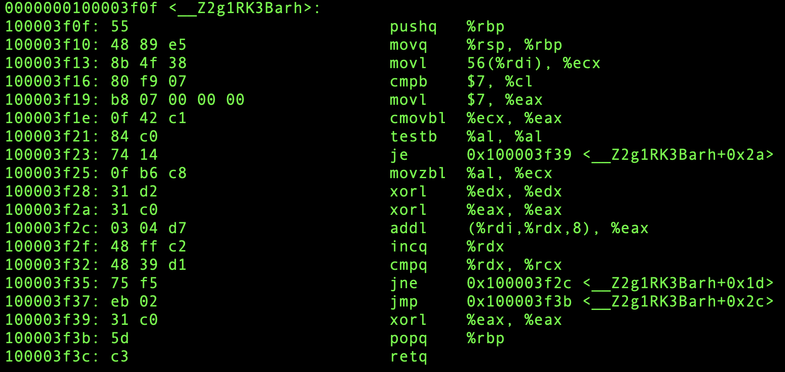
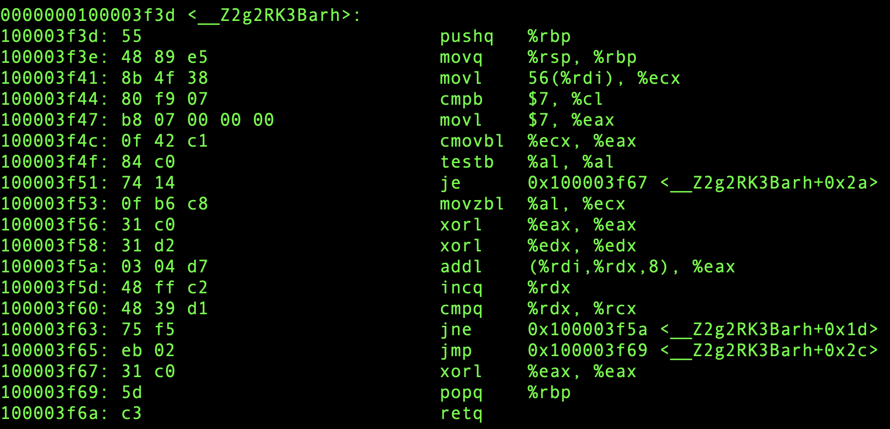
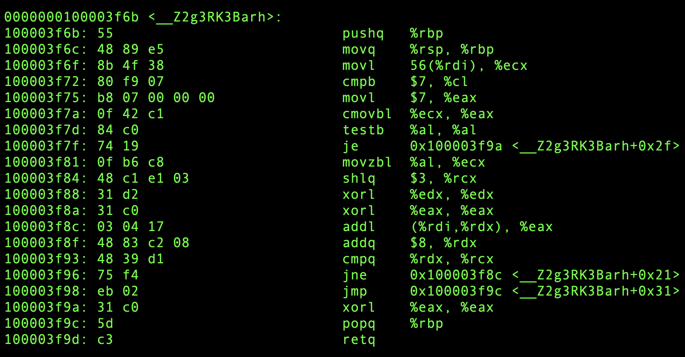
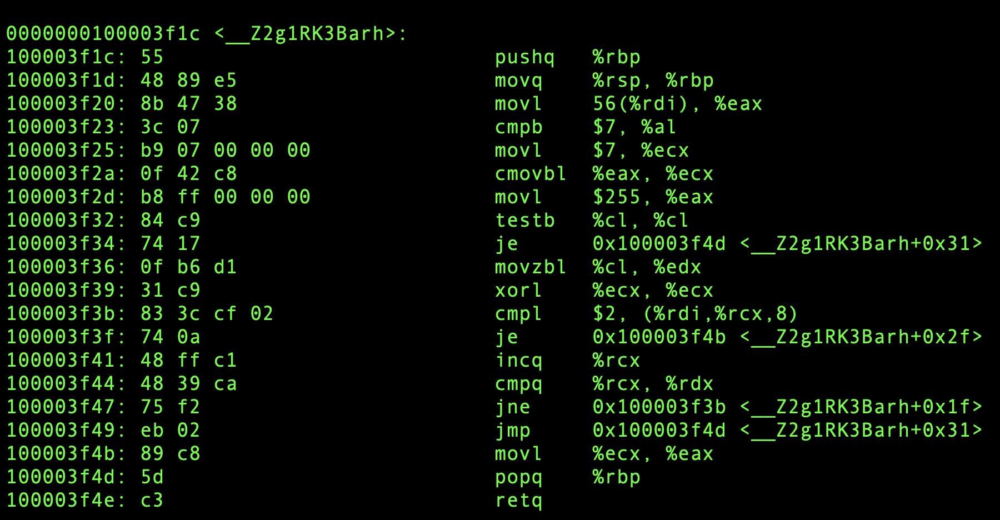
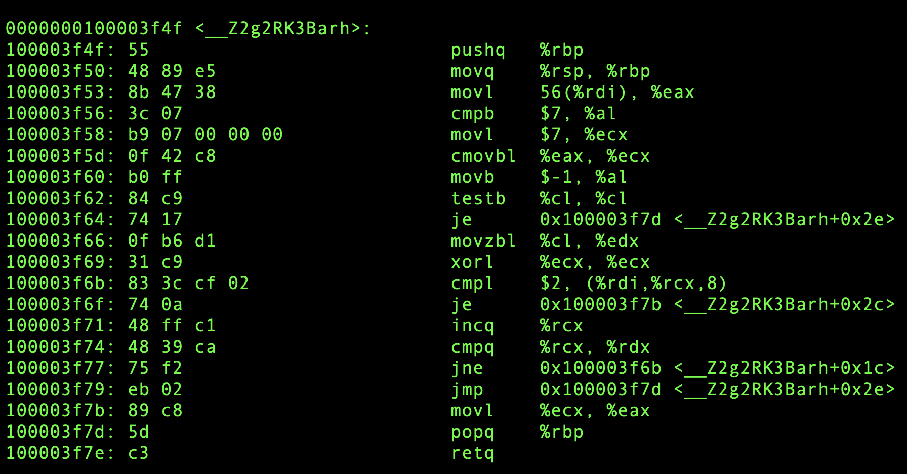
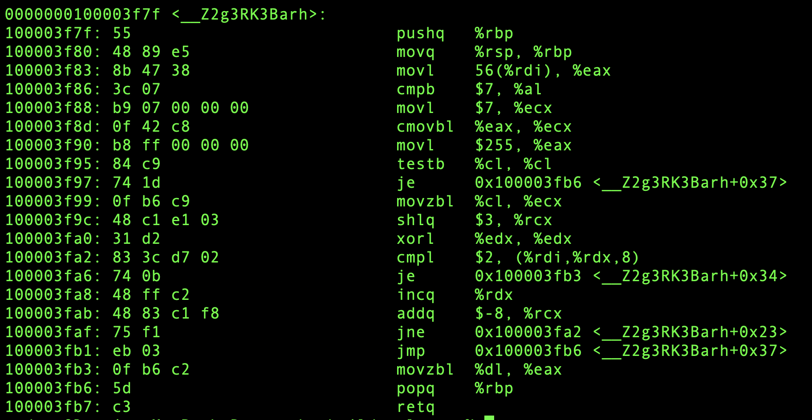
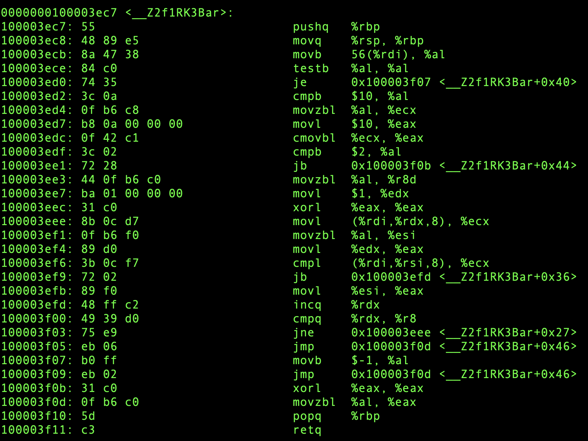
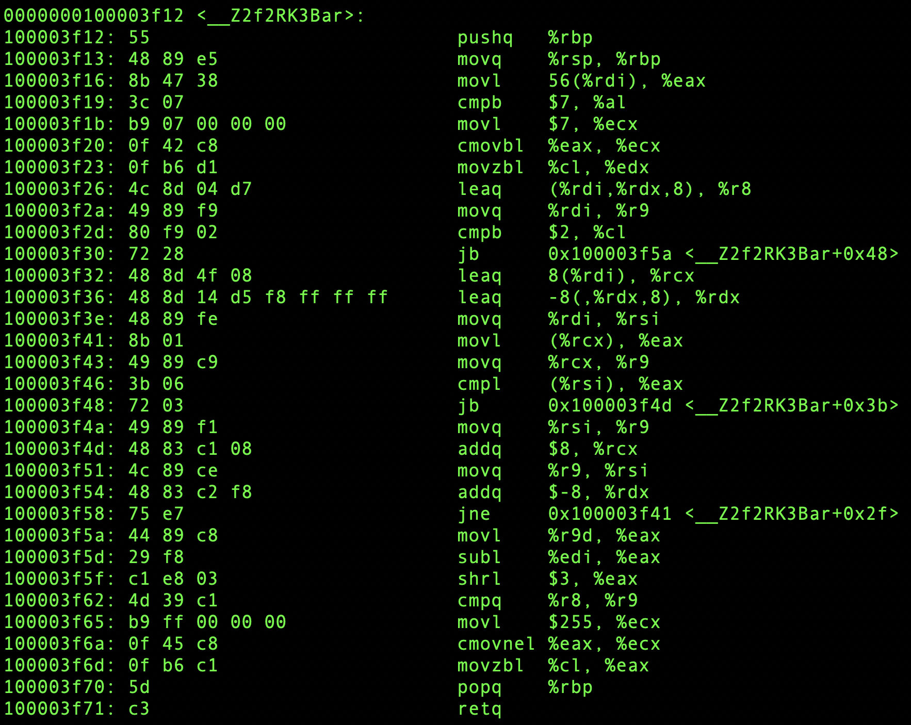
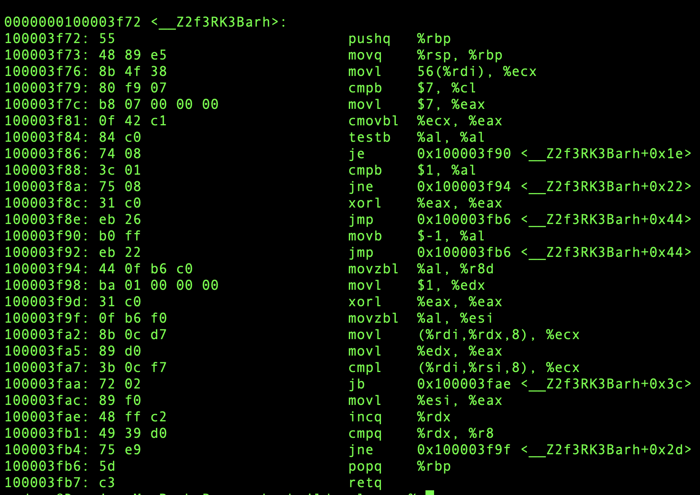

性能
=============

我们不直接给出性能测试结果。而是对照使用 ``ObjectArray`` 库，与不使用时亲自编写相关操作，
生成的指令对比。

  - 平台:  `x64`
  - 编译器： `clang 12.0.5`
  - 编译优化选项： `-Os`

ForEach
-------------------

假设我们定义一个如下的 `array` :

.. code-block:: c++

   struct Foo {
      int a;
      int b;
   };

   struct Bar {
      Foo foo[7];
      uint8_t num;
   };

当我们按照常规去遍历一个数组时，如下是我们的常规做法：

.. code-block:: c++

   auto g1(Bar const& array, uint8_t n) -> uint32_t {
      auto sum = 0;
      auto num = std::min(array.num, (uint8_t)7);
      for(auto i=0; i<num; i++) {
          sum += array.foo[i].a;
      }
      return sum;
   }

对应生成的机器指令如下：

如果我们使用 ``ArrayView`` ，同样的功能，我们可以这样写：

.. code-block:: c++

   auto g2(Bar const& array, uint8_t n) -> uint32_t {
       auto sum = 0;
       ArrayView{array.foo, array.num}.ForEach([&](auto&& ref) {
          sum += ref.a;
       });
       return sum;
   }

注意，``ArrayView`` 在构造时，同样会进行 ``std::min(num, MAX)`` 的操作，所以程序员
不需要亲自写，却同样可以保证访问范围是安全的。

而生成的机器指令如下：

你可以看得出来，使用 ``lambda`` 并没有带来任何开销。甚至可以生成更加精简的指令。

当然，如果我们可以使用 `range-for` , 会觉得舒适得多：

.. code-block:: c++

   auto g3(Bar const& array, uint8_t n) -> uint32_t {
      auto sum = 0;
      for(auto&& ref : ArrayView{array.foo, array.num}) {
          sum += ref.a;
      }
      return sum;
   }

对应生成的指令如下：

Find
----------------

同样的，我们先给出一个普通数组的常规做法：

.. code-block:: c++

   auto g1(Bar const& array, uint8_t n) -> uint32_t {
      auto num = std::min(array.num, (uint8_t)7);
      for(auto i=0; i<num; i++) {
         if(array.foo[i].a == 2) return i;
       }
       return 0xFF;
   }

.. code-block:: c++

   auto g2(Bar const& array, uint8_t n) -> IntOpt<uint8_t> {
      return ArrayView{array.foo, array.num}.FindIndex([&](auto&& ref) {
         return ref.a == 2;
      });
   }

需要注意的是，这里的算法返回值，与之前算法的返回值不一样，前面按照 `C` 语言使用者的常规
做法，直接用 ``0xFF`` 作为非法值。

而后者的做法则是使用接口与 ``std::optional`` 完全一致的，针对整型的 `optional` 语义的实现。

仔细对比，会发现二者生成的指令几乎完全相同。唯一的差别是两个立即数：一个是 ``255`` ，一个是 ``-1`` 。
事实上，对于 `8-bit` 的整数而言，它们是等价的。

因而，我们可以再次得出结论： 至少短小的、可内联的 `lamdba` 本身并不会带来任何性能损失。

.. code-block:: c++

   auto g3(Bar const& array, uint8_t n) -> uint32_t {
      for(auto&& [ref, i] : ArrayView{array.foo, array.num}.WithIndex()) {
          if(ref.a == 2) return i;
      }
      return 0xFF;
   }

通过仔细对比，会发现第三种写法，比前两种多了一条 ``shlq`` 指令，其它地方虽然看似也有少许差异，
但本质上是相同的。而多出的这条指令，并不在循环路径上。

MinElemIndex
------------------

下面我们来看看当查找一个最小元素的索引算法：

.. code-block:: c++

   auto f1(Bar const& array) -> uint8_t {
      if(array.num == 0) return 0xFF;

      uint8_t min = 0;
      auto n = std::min(array.num, (uint8_t)10);
      for(auto i=1; i<n; i++) {
         if(array.foo[i].a < array.foo[min].a) {
            min = i;
         }
      }
      return min;
   }

同样的，这里使用 ``0xFF`` 当作非法索引值。

然后我们再来看看直接使用标准库的实现：

.. code-block:: c++

   auto f2(Bar const& bar) -> uint8_t {
      auto num = std::min(bar.num, (uint8_t)7);
      auto found = std::min_element(bar.foo, bar.foo + num,
           { return l.a < r.a; });
      return found == bar.foo + num ? 0xFF : found - bar.foo;
   }

最后是使用 ``ArrayView`` 的实现：

.. code-block:: c++

   auto f3(Bar const& bar, uint8_t n) -> IntOpt<uint8_t> {
       return ArrayView{bar.foo, bar.num}.MinElemIndex(
            { return l.a < r.a; });
   }

